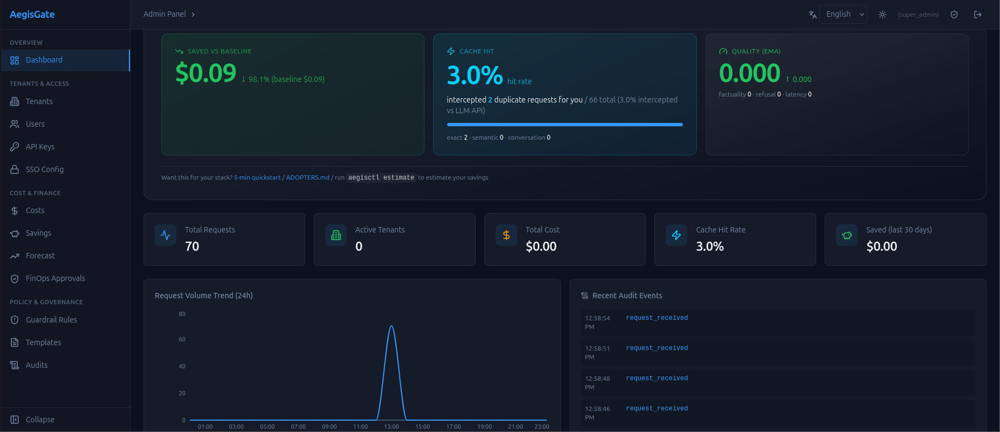

[English](README.md) | [中文](README_zh.md)

# AegisGate

[](https://github.com/privonyx/loong-aegisgate/actions/workflows/ci.yml)
[](https://github.com/privonyx/loong-aegisgate/releases)
[](LICENSE)
[](docs/README.md)
[](https://github.com/privonyx/loong-aegisgate/discussions)
[](https://github.com/privonyx/loong-aegisgate/labels/good%20first%20issue)

> **High-performance AI Gateway for LLM applications.** One OpenAI-compatible
> endpoint with security guardrails, token optimization, semantic cache, smart
> routing, and full observability. Apache-2.0, single binary, **v1.0.0 GA**.

```
Request → [Auth + Rate Limit] → [Inbound Guardrails] → [Token Optimization] → [Semantic Cache] → [Smart Routing] → [Outbound Guardrails] → [Observability] → Response
```



## Features

- **Unified AI Gateway** — One `/v1/chat/completions` endpoint for OpenAI, Claude, DeepSeek, Doubao, Qwen, Gemini, Mistral, and any OpenAI-compatible model. Smart routing (cost-aware, ML scoring, A/B), API-key load balancing, automatic fallback with circuit breaker, token-bucket rate limiting, true per-chunk SSE streaming, Function Calling / Tool Use, and multi-modal proxy (embeddings, images, audio).
- **Token Optimization** — Prompt compression (context truncation, whitespace, dedup), automatic `max_tokens` calculation, CJK-aware token estimation, and per-request savings visibility via `X-AegisGate-Tokens-Saved` header / SSE metadata.
- **Security Guardrails** — Unicode NFKC normalization + zero-width stripping, multi-layer prompt-injection detection (CJK/Cyrillic/English), RE2-based PII masking (ReDoS-proof), optional external safety APIs (OpenAI Moderation / Perspective), abuse detection, topic boundaries, outbound content filtering, hallucination scoring, and tamper-evident audit logging (FNV-1a chain + AES-256-GCM).
- **Semantic Cache** — Pluggable vector store (hnswlib in-process, Milvus, Qdrant), pluggable embedder (hash default or ONNX BGE-small-zh-v1.5 512-dim), per-model partitioning, TTL + LRU eviction, adaptive threshold, and cache-hit short-circuit that skips the model entirely.
- **Observability** — Prometheus metrics at `/metrics` with a prebuilt Grafana dashboard, OpenTelemetry tracing (optional), structured logs with key masking, cost tracking with budgets, output quality scoring, and usage prediction.
- **Storage Abstraction** — `CacheStore` + `PersistentStore` interfaces over in-memory (default), SQLite (WAL), PostgreSQL, and Redis backends; config-driven with graceful degradation to in-memory.
- **Multi-Tenancy & RBAC** *(Enterprise)* — SuperAdmin → TenantAdmin → Developer → Viewer hierarchy, per-tenant isolation, API key lifecycle, SSO (OIDC/PKCE + MFA/TOTP + SCIM 2.0), and a React web management panel.
- **Plugins & Deployment** — `dlopen` C-ABI plugin system, rule marketplace (`aegisctl rules`), prompt templates; ships with Docker, Helm chart, and Redis-backed cluster mode.

→ Full capability details live in the [Architecture guide](docs/guides/architecture.md).

## Editions

A single binary supports both editions via a runtime Feature Gate:

| | Community (Open Source) | Enterprise (Licensed) |
|---|---|---|
| Unified API proxy | ✅ | ✅ |
| Token optimization | ✅ | ✅ |
| Routing | Basic | Smart routing (ML + A/B) |
| Guardrails | Basic | Full + custom rules |
| Management | CLI | Web management panel |
| Cache | In-process LRU | Redis distributed |
| Storage | SQLite | PostgreSQL |
| Deployment | Standalone | Cluster (Helm) |
| Observability | Prometheus | + OTEL tracing + Grafana |
| SSO / RBAC / Audit reports | — | ✅ |
| Plugin system / Rule marketplace | — | ✅ |

## Quick Start

Bring your own OpenAI key and see real cache savings in 5 minutes:

```bash
git clone https://github.com/privonyx/loong-aegisgate.git
cd aegisgate
docker build -t aegisgate:latest .

export OPENAI_API_KEY=sk-...
docker run --rm -it \
  -p 8080:8080 \
  -e OPENAI_API_KEY=$OPENAI_API_KEY \
  -v aegisgate-quickstart-data:/app/data \
  --entrypoint /usr/local/bin/quickstart-entrypoint.sh \
  aegisgate:latest
```

Read the startup banner for your auto-generated API key, then make two identical
calls — the second one hits the cache:

```bash
export QUICKSTART_KEY=...   # from the banner
curl -X POST http://localhost:8080/v1/chat/completions \
  -H "Authorization: Bearer $QUICKSTART_KEY" \
  -H "Content-Type: application/json" \
  -d '{"model":"gpt-4o-mini","messages":[{"role":"user","content":"Hello"}]}'
curl http://localhost:8080/admin/api/savings/summary \
  -H "Authorization: Bearer $QUICKSTART_KEY"
```

📖 **Full 5-minute tutorial:** [docs/quickstart.md](docs/quickstart.md) · Building
from source? See the [Quick Start guide](docs/guides/quick-start.md).

## Documentation

Browse the full [documentation index](docs/README.md). Highlights:

- [5-Minute Quickstart](docs/quickstart.md) — zero-build Docker walkthrough
- [Quick Start](docs/guides/quick-start.md) — build from source + configuration
- [Usage Examples](docs/guides/usage-examples.md) — end-to-end curl session
- [Architecture](docs/guides/architecture.md) — pipeline, routing, storage internals
- [Production Deployment](docs/guides/production-deployment.md) — Docker, Helm, cluster
- [SDK Integration](docs/guides/sdk-integration.md) — Python / Node.js / Go
- [Security Best Practices](docs/guides/security-best-practices.md) — hardening & secrets

## Client SDKs

| Language | Package | Highlights |
|----------|---------|------------|
| [Python](sdk/python/) | `aegisgate` | Sync + async, httpx-based |
| [Node.js](sdk/nodejs/) | `@aegisgate/sdk` | TypeScript, native fetch, ESM |
| [Go](sdk/go/) | `aegisgate-go` | Zero dependencies, stdlib only |

All SDKs provide chat completions (streaming + non-streaming), model listing,
health check, metrics retrieval, and config reload. See the
[SDK Integration guide](docs/guides/sdk-integration.md).

## Community

We'd love to have you involved:

- **GitHub Discussions** — questions, ideas, show-and-tell: [Discussions](https://github.com/privonyx/loong-aegisgate/discussions)
- **Discord** — real-time chat with contributors: [Join Discord](https://discord.gg/aegisgate)
- **Good First Issues** — beginner-friendly tasks: [Good First Issues](https://github.com/privonyx/loong-aegisgate/labels/good%20first%20issue)
- **Used AegisGate? Tell us** — share your savings story in a 5-min form: [seed user feedback](https://github.com/privonyx/loong-aegisgate/issues/new?template=seed_user_feedback.yml), or get listed in [`ADOPTERS.md`](ADOPTERS.md).

## Contributing

We welcome contributions of all kinds — code, docs, bug reports, and ideas.

- See [CONTRIBUTING.md](CONTRIBUTING.md) for setup, coding standards, and PR guidelines
- Read the [Good First Issues Guide](docs/guides/good-first-issues.md) for beginner tasks
- Review our [Code of Conduct](CODE_OF_CONDUCT.md) before participating
- Report security vulnerabilities privately via [SECURITY.md](SECURITY.md)

## Versioning

AegisGate follows [Semantic Versioning](https://semver.org/). See [VERSIONING.md](VERSIONING.md) for API stability guarantees and [CHANGELOG.md](CHANGELOG.md) for release notes.

## License

[Apache License 2.0](LICENSE)

Copyright 2026 Loong Superbank
